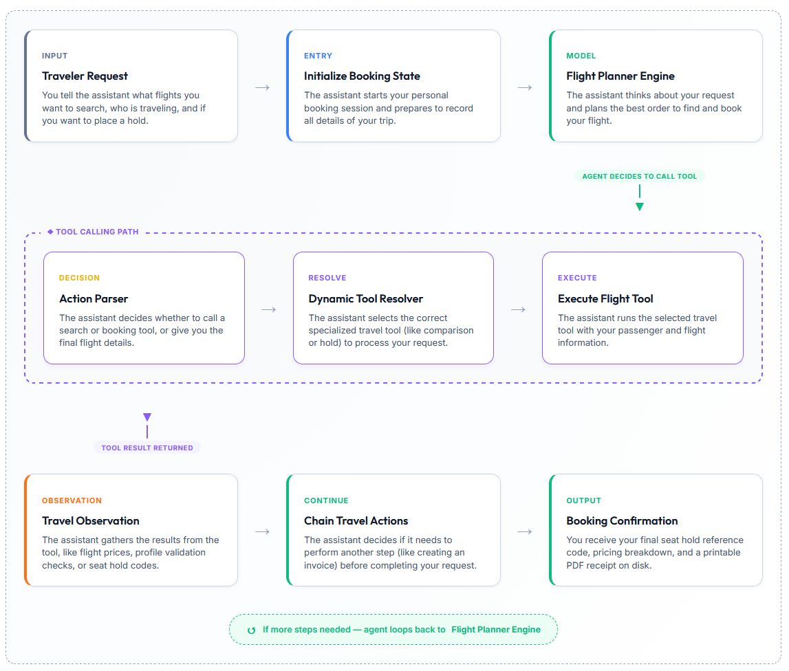

# ✈️ Flight Agent Assistant — ReAct Agent Lab

> **Team 3 · Day 3 Lab · AIO 2025**  
> A conversational AI flight booking assistant powered by the **ReAct (Reasoning + Acting)** paradigm.

---

## 📌 What Is This?

The **Flight Agent Assistant** is a Streamlit-based chatbot that lets you search for flights, validate passenger information, place temporary seat holds, and generate printable PDF invoices — all through a natural language conversation.

The agent follows the **ReAct loop**: it **Reasons** about your request, **Acts** by calling specialized travel tools, and **Observes** the results before deciding its next step.

---

## 🗺️ Agent Workflow

### Booking Pipeline Flowchart



The diagram above shows the full ReAct execution loop:

| Stage | What Happens |
|---|---|
| **Traveler Request** | You describe what you need (flights, hold, invoice) |
| **Initialize Booking State** | Agent starts your session and prepares context |
| **Flight Planner Engine** | LLM reasons and plans the next action |
| **Tool Calling Path** | Agent parses, resolves, and executes the right tool |
| **Travel Observation** | Results are captured and fed back into the loop |
| **Chain Travel Actions** | Agent decides whether to loop again or deliver the answer |
| **Booking Confirmation** | You receive hold codes, pricing, and a PDF receipt |

> 🔁 **The agent loops** back to the Flight Planner Engine until all steps are complete.

---

## 🌐 Interactive Workflow Visualization

For a fully interactive, animated view of the agent loop and tools, open the self-contained HTML page:

👉 **[`agent_workflow_visualization.html`](agent_workflow_visualization.html)** — open in any browser (no server needed)

Features:
- Toggle between **Simple Mode** (customer language) and **Detailed Mode** (developer trace)
- Hover over tool cards to see their use-case and highlight the matching pipeline step
- Click to pin a tool's highlight for closer inspection
- **Print / Save PDF** button for offline use

---

## 🛠️ Tools Available

| Tool | Purpose |
|---|---|
| `compare_flights` | Ranks flights by price, duration, stops, and comfort |
| `collect_personal_info` | Validates passenger name, email, and phone |
| `hold_flight` | Reserves a seat for 15 minutes, returns a hold code |
| `generate_invoice` | Drafts a text receipt with fares, taxes, and 5% service fee |
| `generate_invoice_pdf` | Exports the invoice as a printable Helvetica PDF |

---

## 🚀 Running the App

```bash
# Install dependencies
pip install -r requirements.txt

# Launch the Streamlit chat interface
streamlit run app.py
```

Then open [http://localhost:8501](http://localhost:8501) in your browser.

---

## 📁 Project Structure

```
├── app.py                          # Streamlit chat interface
├── agent_workflow_visualization.html  # Interactive workflow diagram
├── AGENT_WORKFLOW.md               # Detailed developer workflow docs
├── src/
│   ├── agent/agent.py              # ReActAgent core loop
│   ├── tools/
│   │   ├── flight_comparison.py    # compare_flights tool
│   │   ├── user_info_tools.py      # collect_personal_info tool
│   │   ├── hold_tools.py           # hold_flight tool
│   │   └── invoice_tools.py        # generate_invoice + PDF tools
│   ├── core/llm_provider.py        # LLM provider with fallback chain
│   └── telemetry/metrics.py        # Execution metrics tracker
├── report/
│   └── group_report/
│       └── Flight_booking_flowchart_v2.png
└── requirements.txt
```

---

## 📖 Further Reading

- [**AGENT_WORKFLOW.md**](AGENT_WORKFLOW.md) — Deep-dive into the ReAct loop, tool resolution, and execution trace
- [**FEATURES.md**](FEATURES.md) — Full feature list
- [**USAGE_GUIDE.md**](USAGE_GUIDE.md) — Step-by-step usage examples
- [**EVALUATION.md**](EVALUATION.md) — Evaluation criteria and scoring

---

*Developed by Team 3 · AIO 2025 Research Program*
