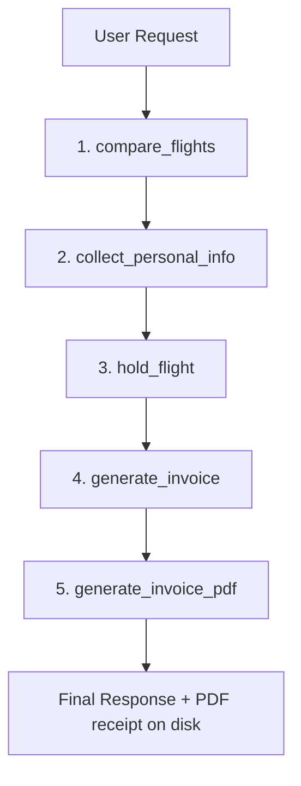

# ✈️ ReAct Agent: Combined Travel Toolkit & Developer Attribution

This document summarizes the specialized flight tools, passenger verification schemas, booking holds, and ticketing systems developed by **Team 3** for the production-grade ReAct Agentic Assistant.

---

## 🚀 The Master Use Case: Combined Booking Pipeline (Multi-Tool Flow)

This is the ultimate, end-to-end traveler flow that requires the agent to reason across and chain **five distinct tool families** to resolve a single user request.

### 👤 Traveler Scenario
**Alex, a digital nomad and software engineer**, wants to travel from Paris Charles de Gaulle (CDG) to Austin, Texas (AUS) on 2026-03-03. He wants the absolute best-scoring flight in terms of convenience and price, wants his passenger details verified safely, wants a temporary hold placed on his selection, and needs a formatted invoice along with a printable PDF receipt written to his local workspace.

### ⚙️ Multi-Step Agent Execution Pipeline
To solve this, the agent automatically executes the following 5-step loop:

1. **Step 1 — Flight Selection via Comparison & Scoring**:
   The agent runs `compare_flights(departure_airport="CDG", arrival_airport="AUS", departure_date="2026-03-03", sort_by="recommended")`. It reviews the returned ASCII matrix, identifies the top-scored flight (British Airways, $520.0), and extracts its unique `booking_token`.
2. **Step 2 — Profile Validation**:
   The agent collects Alex's information and executes `collect_personal_info(passenger_name="Nguyen Van A", passenger_email="vana@email.com", passenger_phone="0901234567")` to perform declarative Pydantic v2 validation.
3. **Step 3 — simulated Temporary Hold**:
   With the validation success, the agent calls `hold_flight(booking_token="sample_token_1", passenger_count=1, hold_minutes=15, expected_price=520.0)` which outputs a unique hold reference code: `HOLD-E5A2B9C1`.
4. **Step 4 — Ticket Invoice Generation**:
   The agent calculates prices and generates the formatted receipt by calling `generate_invoice(...)`.
5. **Step 5 — Physical PDF File Export**:
   Lastly, the agent runs `generate_invoice_pdf(invoice_result=..., output_path="invoice_BK-2F9A1B8C.pdf")` to output a physical Helvetica-style confirmation PDF onto the traveler's drive.

---

## 📋 Comprehensive Tool Inventory & Developer Attribution

| Component Module | Tool Function | Purpose & Use Case | Contributor / Developer |
| :--- | :--- | :--- | :--- |
| **`flight_comparison.py`** | `compare_flights()` | **Problem Solved:** Traditional search engines only list raw items. This compares multiple segments and applies a weighted scoring algorithm (`40% price`, `30% duration`, `20% stops`, `10% rating`) to recommend the absolute best choice dynamically. **Signature:** `compare_flights(departure_airport, arrival_airport, departure_date, sort_by)` | **Nguyễn Khánh Toàn** |
| **`user_info_tools.py`** | `collect_personal_info()` | **Problem Solved:** Enforces strict formatting constraints (email syntax regex, phone character set matching, YYYY-MM-DD age checks) on passenger details before booking pipelines start to avoid downstream transaction failures. **Signature:** `collect_personal_info(passenger_name, passenger_email, passenger_phone, date_of_birth)` | **Nguyễn Khánh Toàn** |
| **`user_info_tools.py`** | `collect_address_info()` | **Problem Solved:** Gathers and formats street, city, state, and postal code requirements with declarative Pydantic schemas. **Signature:** `collect_address_info(street, city, state, postal_code, country)` | **Nguyễn Khánh Toàn** |
| **`user_info_tools.py`** | `collect_travel_preferences()`| **Problem Solved:** Captures special traveler requirements (vegetarian/vegan meals, window/aisle seat layouts, and budget ceilings) to tailor routing filters. **Signature:** `collect_travel_preferences(preferred_airline, seat_preference, meal_preference, ...)` | **Nguyễn Khánh Toàn** |
| **`user_info_tools.py`** | `validate_all_user_info()` | **Problem Solved:** Performs a single batch validation pass over personal, address, and preference dicts, reducing agent invocation latency. **Signature:** `validate_all_user_info(user_data)` | **Nguyễn Khánh Toàn** |
| **`hold_tools.py`** | `hold_flight()` | **Problem Solved:** Safely simulates the reservation lock process, calculating expiration times and returning unique references (`HOLD-XXXXXXXX`) without charging actual money. **Signature:** `hold_flight(booking_token, passenger_count, hold_minutes, expected_price)` | **Phạm Thị Linh Chi** |
| **`hold_tools.py`** | `get_hold()` | **Problem Solved:** Allows the agent or customer to fetch active hold statuses using the hold reference code to verify validity. **Signature:** `get_hold(hold_code)` | **Phạm Thị Linh Chi** |
| **`invoice_tools.py`** | `generate_invoice()` | **Problem Solved:** Builds a highly visual, clean ASCII invoice table summarizing traveler details, segment specifics, pricing subtotals, and service fees (5%). **Signature:** `generate_invoice(passenger_name, flight_id, airline, departure_airport, arrival_airport, departure_time, arrival_time, duration, price_per_person, ...)` | **Đinh Nhật Thành & Lưu Thiện Việt Cường** |
| **`invoice_tools.py`** | `generate_invoice_pdf()` | **Problem Solved:** Converts the text invoice metadata into a printable, beautifully styled PDF file containing custom company branding, section cards, and bold totals. **Signature:** `generate_invoice_pdf(invoice_result, output_path)` | **Đinh Nhật Thành & Lưu Thiện Việt Cường** |

---

## 🛠️ Flight Scoring Comfort Algorithms (Digital Nomad Essentials)

In addition to teammate additions, the toolkit supports three customized nomad tools in `flight_tools.py`:
1. **`find_productivity_flights()`**: Scans flights in `data.json` and ranks them based on work conveniences (Free Wi-Fi: `+30`, Paid Wi-Fi: `+15`, Power Outlets: `+30`, Legroom > 30": `+15`, Legroom < 30": `-15`, Overnight Layovers: `-30`). (Contributor: Đinh Nhật Thành & Lưu Thiện Việt Cường)
2. **`time_until_flight()`**: Computes flight countdowns relative to a reference timezone clock. (Contributor: Phạm Thị Linh Chi)
3. **`parse_flight_details()`**: Audit segments, layouts, layover structures, aircraft, and change policies. (Contributor: Nguyễn Khánh Toàn)
